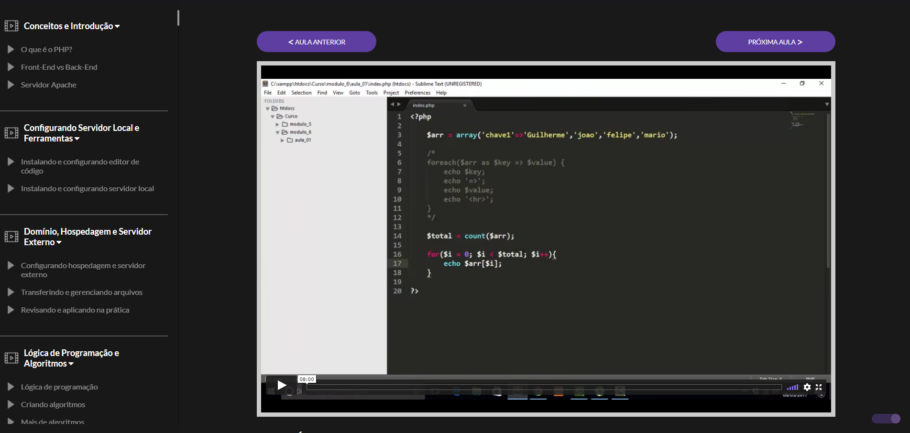

<!-- README PADRONIZADO DO DIEGO CRIVELARO ❤ -->

<h1 align="center">🚀 Curso de BackEnd da DankiCode</h1>
<h4 align="center">📚 Estudando </h4>
<p align="center">📌 Neste repositório eu irei disponibilizar todos exercícios, projetos e práticas do curso BackEnd da DankiCode</p>

<p align="center">
  
  <a href="https://github.com/diegocrivelaro/WEBMaster-BackEnd-Completo-DankiCode/blob/main/LICENCE"></a>
  <a href="https://github.com/diegocrivelaro/WEBMaster-BackEnd-Completo-DankiCode/stargazers"></a>
  <a href="https://github.com/diegocrivelaro/WEBMaster-BackEnd-Completo-DankiCode/network"></a>
</p>

---

# 📖 Índice
* <a href="#-Demonstração">🖼 Demonstração</a>
* <a href="#-Módulos-concluídos">✅ Módulos concluídos</a>
* <a href="#-Tecnologias">⚡ Tecnologias</a>
* <a href="#-Como-fazer-download">🚀 Como fazer download</a>
  * <a href="#-Pré-requisitos">📑 Pré-requisitos</a>
* <a href="#-Contribuidores">👨‍💻 Contribuidores</a>
  * <a href="#-Como-contribuir?">💪 Como contribuir?</a>
* <a href="#-Autor">🙋‍♂️ Autor</a>
* <a href="#-Licença">📝 Licença</a>
* <a href="#-Versões-do-README">📜 Versões do README</a>

---
## 🖼 Demonstração

<p align="center">
    
</p>

---

## ✅ Módulos concluídos
- [X] Conceitos e Introdução
- [X] Configurando Servidor Local e Ferramentas
- [x] Domínio, Hospedagem e Servidor Externo
- [x] Lógica de Programação e Algoritmos
- [x] PHP Básico
- [ ] PHP Intermediário
- [ ] PHP Orientado a Objetos
- [ ] Banco de dados e PHP
- [ ] Criando Site Dinâmico - HTML5 e Marcação 
- [ ] Criando Site Dinâmico - CSS/CSS3/Design Responsivo
- [ ] Criando Site Dinâmico - JavaScript/JQuery e PHP
- [ ] Criando Site Dinâmico - PHP
- [ ] Painel de Controle - Interface e PHP
- [ ] Painel de Controle - PHP Avançado e Sistemas
- [ ] Ferramentas de Alta Produtividade para Desenvolvimento
- [ ] Manipulando Arquivos e Diretórios com PHP 
- [ ] Leitura Avançada com PHP
- [ ] Criando Portal de Notícias + Gestão
- [ ] Colocando Sites e Sistemas Online
- [ ] SEO, Analytics e Google WebMaster Tools 
- [ ] Web Services e API
- [ ] Conheça o Composer 
- [ ] BootStrap e PHP
- [ ] MVC e Rotas
- [ ] Conceitos avançados do PHP e PHP7
- [ ] Segurança no PHP
- [ ] Criando Sistema de Gestão de Clientes 
- [ ] Criando Sistema de Controle Financeiro
- [ ] Criando Sistema de Controle de Estoque 
- [ ] Criando Sistema de Gestão de Imóveis
- [ ] Criando Site de Imóveis
- [ ] Criando Chat Online
- [ ] Criando Sistema de Calendário e Agenda 
- [ ] Criando Site com Login + Sistema de Comentários 
- [ ] Criando Site e Sistema de Fórum
- [ ] Criando Loja Virtual/E-Commerce
- [ ] Criando Plataforma EAD Completa
- [ ] Criando uma Rede Social Completa
- [ ] Criando Sistema de Suporte Personalizado
- [ ] Criando Sistema de Email Marketing 
- [ ] Frameworks PHP 
- [ ] Web Scraping
- [ ] Prospecção de clientes, Técnicas de Venda e Produtividade
- [ ] Extras 
- [ ] Gateways de pagamento (Bônus)
- [ ] GIT
- [ ] Criando Sistema de Delivery
- [ ] Criando Sistema de SMS 
- [ ] PHP 7.3
- [ ] Criando Aplicativo/Sistema Tinder
- [ ] Criando Editor de Arquivo Online 
- [ ] Criando Sistema de Relatório 
- [ ] Criando Motor de Busca
- [ ] Criando Chatbot (IBM Watson)
- [ ] Criando Painel CMS V2.0 (Avançado) 
- [ ] Chrome Tools para Desenvolvedores
- [ ] Docker 
- [ ] MongoDB
- [ ] Aprendendo a utilizar AWS
- [ ] NextJS 
- [ ] GraphQL
- [ ] PHPUnit (Testes) 
- [ ] PHP 8
---

## ⚡ Tecnologias
As seguintes tecnologias aprendidas durante o curso:

- [PHP](https://www.php.net)
- [MySQL](https://www.mysql.com)
- [JavaScript](https://developer.mozilla.org/pt-BR/docs/Web/JavaScript)
- [JQuery](https://jquery.com)
- [Bootstrap](https://getbootstrap.com)
- [WordPress](https://wordpress.com)
- [Docker](https://www.docker.com)
- [AWS](https://aws.amazon.com/pt/)
- [NextJS](https://nextjs.org)
- [GraphQL](https://graphql.org)
- [PHPUnit](https://phpunit.de)
---

## 🚀 Como fazer download
```bash
# Clone este repositório
$ git clone https://github.com/diegocrivelaro/WEBMaster-BackEnd-Completo-DankiCode.git

# PRONTO!
```

### 📑 Pré-requisitos
1. Tenha o Git instalado no Windows.
---

## 👨‍💻 Contribuidores
❤️ Muito obrigado para essa galera que contribuiu e fez com que o projeto melhorasse! 👏
<!-- <table>
  <tr>
    <td align="center"><a href="PERFIL-DO-GIT"><br /><sub><b>NOME</b></sub></a><br /><a href="PERFIL-DO-GIT"></a></td>
  </tr>
</table>  -->

### 💪 Como contribuir?
1. Faça um <b>fork</b> do projeto
2. Crie uma nova branch com as suas alterações: `git checkout -b minha-feature`
3. Salve as alterações e crie uma mensagem de commit contando o que você fez: `git commit -m "feature: minha feature`
4. Envie as suas alterações: `git push origin minha-feature`
---

## 🙋‍♂️ Autor


<a href="https://www.linkedin.com/in/diegocrivelaro/">Diego Crivelaro</a>
<br>
<p>
    <a href="https://www.linkedin.com/in/diegocrivelaro/"></a>
    <a href="https://github.com/diegocrivelaro"></a>
    <a href="https://www.instagram.com/diego_crivelaro/"></a>
</p>

---

## 📝 Licença
Este projeto está sobe a licença MIT

---

## 📜 Versões do README
[Português BR](./README.md)
